<h1 align="center">知径 LearnPath</h1>
<p align="center"><strong>把知乎的高赞回答，变成你的学习路径。</strong></p>
<p align="center">知乎黑客松 2026 · 校园新锐季 · 方向二「知识炼金场：学习工具与知识生产」参赛作品</p>
<p align="center">
  
  
  
  
  
</p>

---

## 这是什么

知乎上沉淀了海量「把一个领域讲透」的高赞回答与专栏，但它们是**离散的**：搜到十篇好文章，仍然不知道先看哪篇、看完了算不算懂、下一步学什么。

**知径 LearnPath** 把它们变成**结构化、可验证、会成长**的学习路径：

1. **说出目标** —— 「我想搞懂 Transformer，能读懂论文和源码」，加上你的基础和时间预算。
2. **先问清楚再规划** —— AI 主动追问 2-4 个关键问题（前置知识、目标深度、学习偏好），选项可点选也可自己说明；可附上课程大纲、考试范围等附件。
3. **生成知识图谱** —— 把目标拆成模块 → 知识点，标出前置关系、难度和预计时长，画成可视化图谱。
4. **知乎来源锚定** —— 每个知识点通过知乎数据开放平台检索高赞回答与专栏，作为讲解和出题的**证据**。
5. **带引用的讲解** —— 定义 → 直觉 → 要点 → 误区 → **知乎观点对照** → 自检，每句话都能点回原文，公式 KaTeX 渲染。
6. **证据驱动的掌握度** —— 3 道单选 + 1 道费曼解释题（AI 评分），形成证据链，更新 ★☆☆ 星级。
7. **推荐下一步** —— 按前置关系、掌握度和时间预算推荐「现在最值得学的知识点」。
8. **一键沉淀** —— 复习卡片、追问答疑（导师 / 知乎直答双引擎）、导出 Markdown 学习清单。
9. **学习档案与控制台** —— 每一次澄清、提问、答题、上传都写入个人档案（背景 / 已掌握 / 目标 / 偏好 / 进度），后续路线、讲解、出题都参考它；控制台集中查看学习路径、档案、档案馆（互动记录）与附件。
10. **知乎账号登录** —— OAuth 登录后档案与路径跟随账号；访客期间的数据在登录时自动合并。
11. **从热榜出发** —— 首页接入知乎热榜，一键「学热点背后的知识」。

设计参考了开源项目 [LearnGraph](https://github.com/SunnyBoy-y/LearnGraph) 的 **G-R-E-M-A 学习闭环**（Goal → Representation → Evidence → Mastery → Action），并把「知乎内容」作为整个闭环的证据底座。

```text
学习目标 ─► 澄清追问 ─► 知识图谱（模块/知识点/前置关系）─► 知乎来源锚定（开放平台搜索 + 全文）
    ▲            │                                                        │
    │            ▼                                                        ▼
 下一步推荐 ◄── 学习档案 ◄── 掌握度（星级/证据链） ◄── 讲解 · 测验 · 费曼解释 · 卡片 · 追问
```

## 产品截图

| 首页：目标输入 · 知乎热榜 | 知识图谱工作台 |
| --- | --- |
| 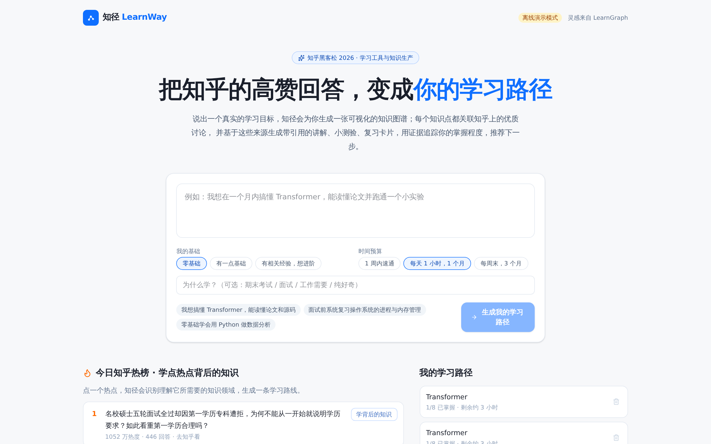 | 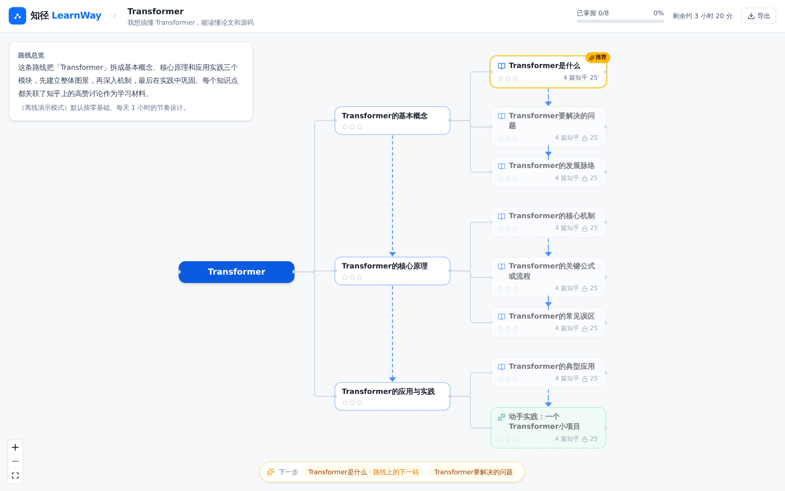 |

| 带引用的讲解 | 知乎来源 |
| --- | --- |
| 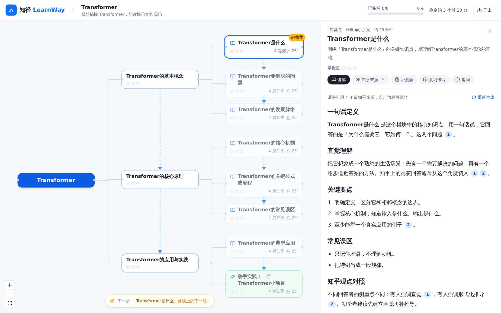 | 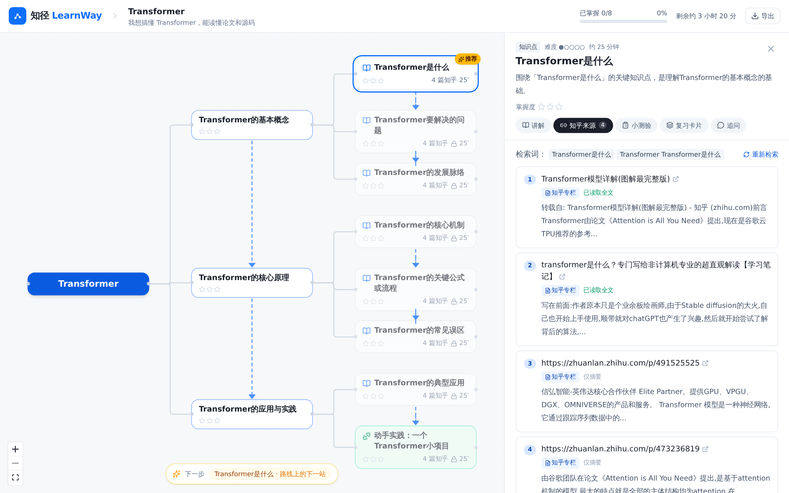 |

| 小测验与费曼评分 | 复习卡片 |
| --- | --- |
| 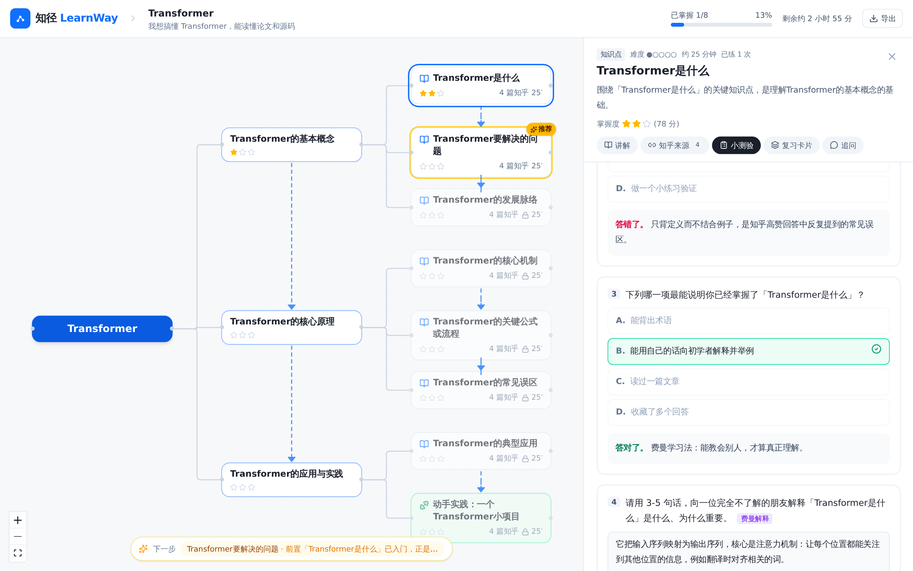 | 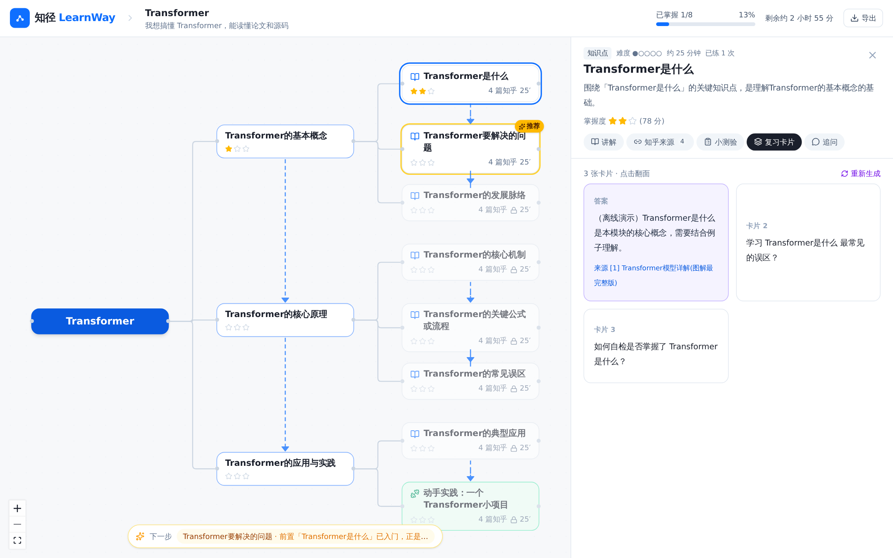 |

| 目标澄清追问 | 公式渲染的讲解（真实 LLM + 官方知乎来源） |
| --- | --- |
| 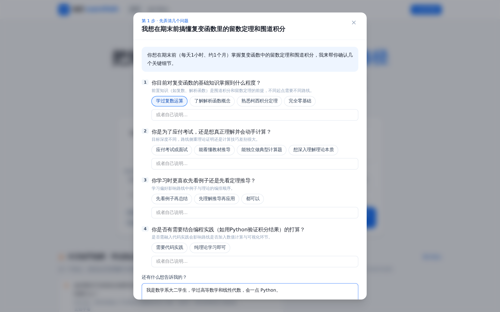 | 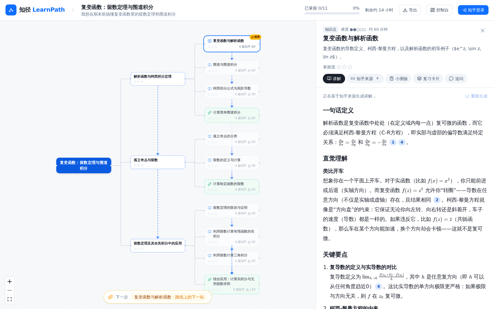 |

| 控制台 · 学习档案 | 控制台 · 档案馆 | 知乎登录 |
| --- | --- | --- |
| 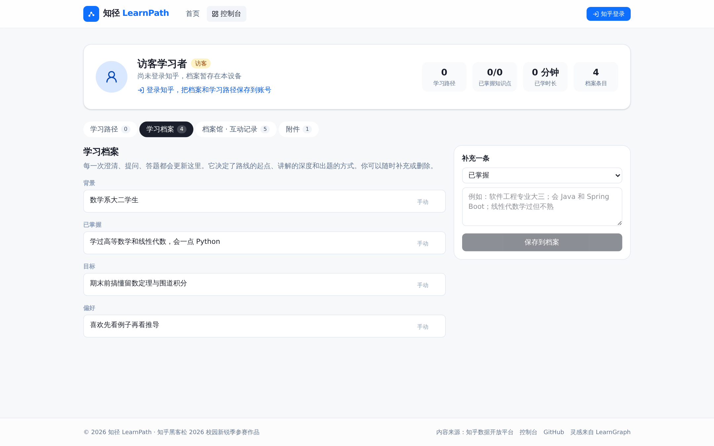 | 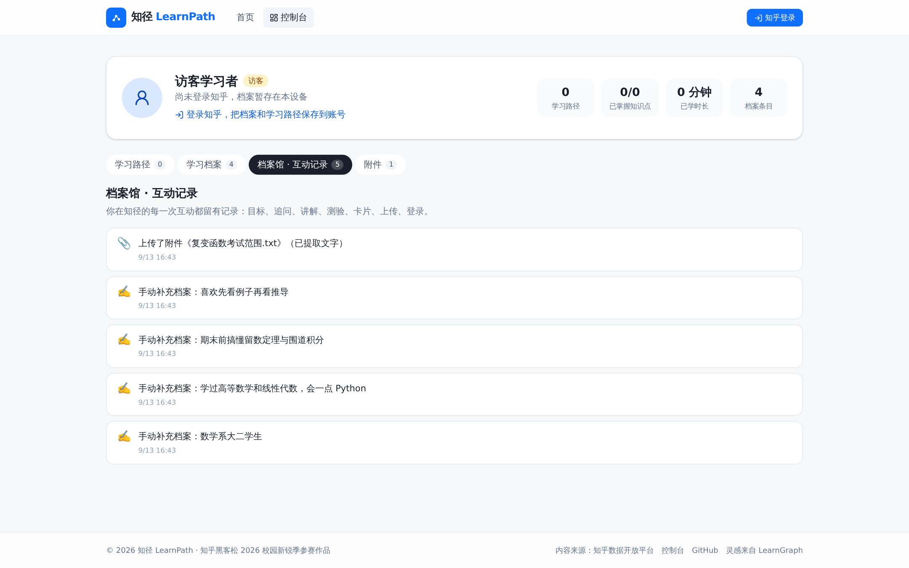 | 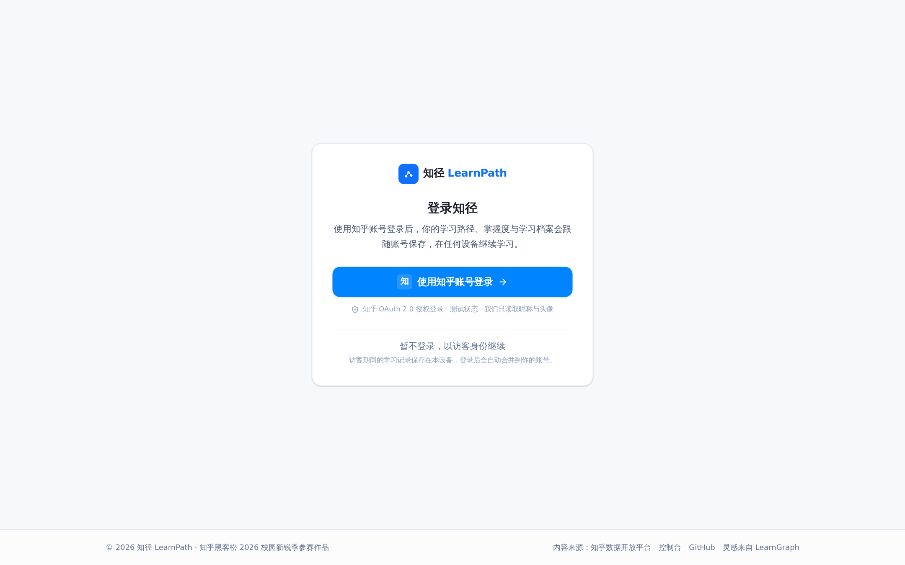 |

> 截图由 `cd frontend && npm run screenshot` 在离线演示模式下自动生成（Playwright），知乎来源为真实检索结果。

## 快速开始

环境：Python 3.11+、Node.js 20+。推荐用 [uv](https://docs.astral.sh/uv/) 管理 Python 依赖。

```bash
git clone <this repo> learnpath && cd learnpath

# 1) 后端
cd backend
uv venv .venv && uv pip install --python .venv/bin/python -r requirements.txt
cp .env.example .env            # 按需填写 LLM / 知乎开放平台配置（见下）
.venv/bin/uvicorn app.main:app --port 8000 --reload

# 2) 前端（另一个终端）
cd frontend && npm install && npm run dev      # http://127.0.0.1:5173
```

或者一条命令同时启动两端：`./scripts/dev.sh`。

生产形态（单进程、单端口）：`./scripts/build.sh` 构建前端后，FastAPI 会在 `http://127.0.0.1:8000` 同时提供页面与 `/api`。也可以 `docker compose up --build`。

| 地址 | 说明 |
| --- | --- |
| `http://127.0.0.1:5173` | 开发模式前端（代理 `/api` 到 8000） |
| `http://127.0.0.1:8000` | 生产模式单入口（需先构建前端） |
| `http://127.0.0.1:8000/docs` | OpenAPI 文档 |
| `http://127.0.0.1:8000/api/health` | 当前 LLM / 知乎数据通道状态 |

### 配置 LLM

`backend/.env`（前缀 `LEARNPATH_`）：

| 变量 | 说明 |
| --- | --- |
| `LEARNPATH_LLM_PROVIDER` | `auto`（默认）/ `anthropic` / `openai` / `mock` |
| `ANTHROPIC_API_KEY` 或 `ANTHROPIC_AUTH_TOKEN`、`ANTHROPIC_BASE_URL` | 官方 Anthropic SDK 读取；`LEARNPATH_ANTHROPIC_MODEL` 默认 `claude-opus-5` |
| `LEARNPATH_ANTHROPIC_BETAS` | 某些中转需要的 beta 头，如 `context-1m-2025-08-07` |
| `OPENAI_API_KEY`、`OPENAI_BASE_URL`、`LEARNPATH_OPENAI_MODEL` | 任意 OpenAI 兼容接口（DeepSeek / Qwen / Kimi / Ollama…） |

`mock` 模式不需要任何 key：图谱、讲解、测验、卡片都用本地占位内容生成，但**知乎检索与全文读取仍是真实的**，方便离线演示交互流程。线上演示环境使用 OpenAI 兼容接口上的 `deepseek-v4-flash`（`LEARNPATH_LLM_PROVIDER=openai`）。

### 配置知乎数据通道

| 通道 | 状态 | 说明 |
| --- | --- | --- |
| **知乎数据开放平台（官方）** | 已接入 | 配置 `ZHIHU_ACCESS_SECRET` 后，知乎搜索 / 热榜 / 直答优先走官方接口；字段映射、额度与缓存策略见 [docs/zhihu-open-platform.md](docs/zhihu-open-platform.md) |
| 知乎直答 | 已接入 | 追问面板可切换「导师」（引用本知识点来源作答）与「直答」（知乎官方 AI 搜索，流式返回） |
| Jina Search / Brave Search API | 可选 | 带 key 的检索兜底（`JINA_API_KEY` / `BRAVE_SEARCH_API_KEY`），Jina 结果自带全文 |
| 站内搜索匿名兜底 | 内置 | Brave / 360 / Bing 的 `site:zhihu.com` 检索，无 key，有限流 |
| 全文读取 | 内置 | Jina Reader（`LEARNPATH_READER_BASE`，可选 `JINA_API_KEY`） |

所有检索结果与页面正文都会缓存在 SQLite（`backend/data/learnpath.db`），重复演示不再消耗额度或发网络请求。`GET /api/quota` 可查看开放平台当日剩余额度。

### 知乎账号登录（OAuth，测试状态）

支持用知乎账号登录（知乎 OAuth 2.0 授权码流程：`openapi.zhihu.com` 的 authorize / access_token / user 接口）。代码与 Mock 测试已完成，等待黑客松项目页面分配的 App ID / App Key 做线上联调；未配置时登录入口自动隐藏。流程、配置、字段映射与联调清单见 [docs/zhihu-oauth.md](docs/zhihu-oauth.md)。

## 技术架构

```text
frontend/  React 19 + TypeScript + Vite + Tailwind v4
           ├─ pages/Home           目标输入 · 知乎热榜 · 我的路径
           ├─ pages/GraphPage      图谱工作台（轮询生成进度 · 下一步推荐 · 导出）
           ├─ components/graph     React Flow + dagre 自动布局的知识图谱
           └─ components/panel     讲解(SSE 流式+引用角标) · 知乎来源 · 小测验 · 复习卡片 · 追问

backend/   FastAPI + SQLAlchemy(SQLite WAL) + Anthropic SDK
           ├─ api/routes.py        REST + SSE 接口
           ├─ services/graph_builder   目标 → 结构化图谱（LLM structured output）→ 后台流水线
           ├─ services/grounding       每个知识点：检索 → 去重 → 读取全文 → 关联来源（线程池 + 缓存）
           ├─ services/learning        讲解 / 出题 / 费曼评分 / 卡片 / 答疑 / Markdown 导出
           ├─ services/progress        掌握度星级 · 前置解锁 · 下一步推荐（G-R-E-M-A 的 M 与 A）
           ├─ services/oauth           知乎 OAuth 授权码流程（测试状态）· 签名 state · 会话
           ├─ llm/                     Provider 抽象：Anthropic（官方 SDK）· OpenAI 兼容 · Mock
           └─ zhihu/                   official（数据开放平台：搜索/热榜/直答/额度）· search（Jina/Brave/360/Bing 兜底）· reader（Jina）· hot（匿名热榜兜底）
```

关键设计：

- **稳定性优先**：所有模型调用带指数退避的隐式重试；全部失败时退回确定性内容（来源摘要版讲解、通用测验、基础路线骨架）并以「临时版本」标注，前端对失败的图谱自动静默重试一次，网络抖动时轮询不中断——学习者永远不会看到一堵错误墙。

- **证据优先**：讲解、出题、评分的 prompt 都只拿到「编号化的知乎来源」，输出必须用 `[n]` 引用；前端把角标渲染成可点回原文的链接，保证「AI 说的每句话都能溯源」。
- **掌握度是算出来的，不是宣称的**：单选题本地判分、费曼解释由模型按「定义 / 例子 / 机制」三维打分，加权后做指数平滑，映射到 0-3 星；模块星级由子节点聚合。
- **软解锁**：前置知识点未入门的节点会标注「建议先学 …」，但不阻止学习者跳读。
- **可替换的模型与数据通道**：LLM 与知乎数据源都是端口-适配器结构；官方开放平台接口一旦可用，只改一个文件。
- **离线可演示**：Mock LLM + SQLite 缓存，让流程在无 key、弱网环境下也能完整跑通。

## API 一览

| 方法 | 路径 | 说明 |
| --- | --- | --- |
| POST | `/api/goals` | 创建学习目标，后台生成图谱并锚定知乎来源 |
| GET | `/api/graphs/{id}` | 图谱、节点、边、统计、下一步推荐（生成中可轮询进度） |
| GET | `/api/graphs/{id}/export.md` | 导出 Markdown 学习清单 |
| GET | `/api/nodes/{id}` | 知识点详情：来源、讲解、证据、对话、卡片、前置 |
| POST | `/api/nodes/{id}/lesson` | SSE 流式讲解（带引用） |
| POST | `/api/nodes/{id}/quiz` → `/api/quizzes/{id}/submit` | 出题与评分，更新掌握度 |
| POST | `/api/nodes/{id}/cards` | 复习卡片 |
| POST | `/api/nodes/{id}/chat` | SSE 流式追问，`mode: tutor \| zhida` |
| POST | `/api/nodes/{id}/ground` | 重新检索该知识点的知乎来源 |
| POST | `/api/goals/clarify` | 目标 → 2-4 个追问（前置知识 / 深度 / 偏好） |
| GET | `/api/me` · `/api/me/dashboard` | 当前学习者（访客或知乎账号）与控制台数据 |
| POST/DELETE | `/api/me/facts` | 学习档案条目 |
| POST/GET/DELETE | `/api/attachments` | 附件上传、列表、下载、删除（txt/md/pdf/docx…） |
| GET | `/api/hot` | 知乎热榜（官方接口，30 分钟缓存） |
| GET | `/api/quota` | 知乎数据开放平台当日剩余额度 |
| GET/POST | `/api/auth/me` · `/api/auth/zhihu/login` · `/api/auth/zhihu/callback` · `/api/auth/logout` | 知乎 OAuth 登录（测试状态，见 docs/zhihu-oauth.md） |
| GET | `/api/health` | 运行状态 |

## 测试

```bash
cd backend && .venv/bin/python -m pytest -q     # 10 个用例：知乎解析器 + 端到端学习流程（mock LLM，无网络）
cd frontend && npm run typecheck && npm run build
```

## 路线图

- 知乎 OAuth 线上联调（等待 App ID / App Key），登录后用「我的收藏 / 创作」作为个性化起点（`X-OAuth-Token` + 用户数据 API）
- 接入黑客松「知乎知识」内容接口作为学习素材来源
- 多 Agent 协作：资料整理 Agent + 观点对照 Agent + 出题 Agent 并行工作
- 学习状态随时间衰减、复习提醒（间隔重复）
- 图谱人在回路修订：拖拽增删节点、审核 AI 的更新建议
- 移动端与刘看山 IP 形象的学习陪伴

## 致谢

- [LearnGraph](https://github.com/SunnyBoy-y/LearnGraph)（MIT）：G-R-E-M-A 学习闭环、目标图谱 / 能力图谱的产品思路
- 知乎社区的每一位认真回答问题的人

MIT License.
